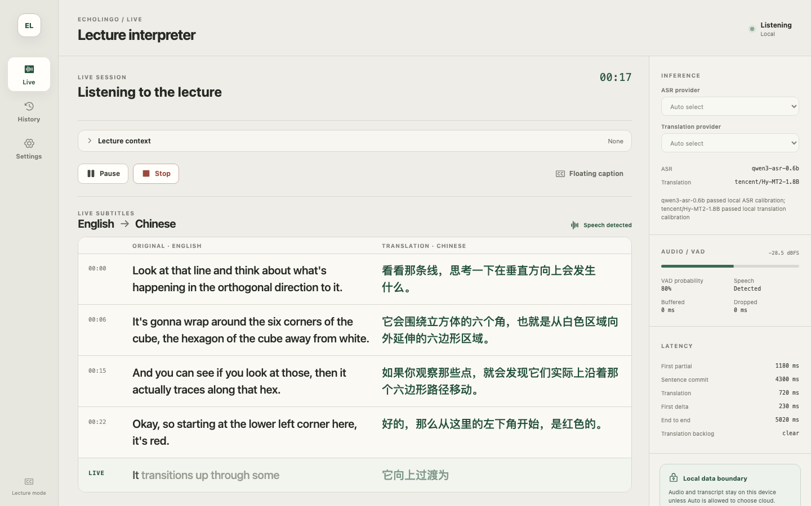
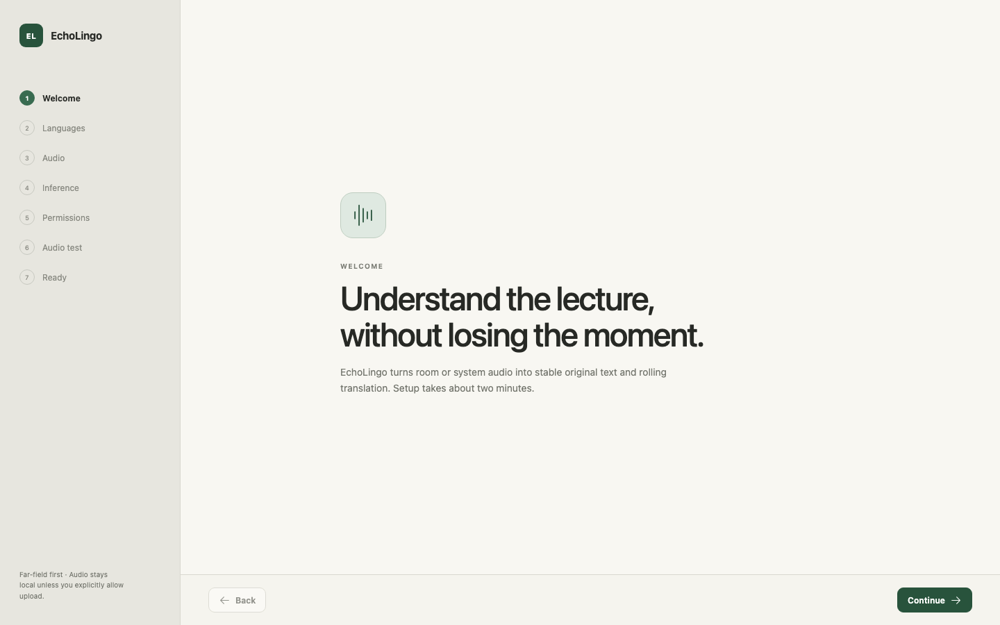
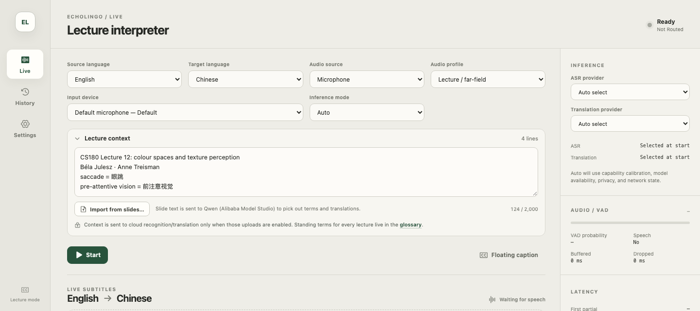
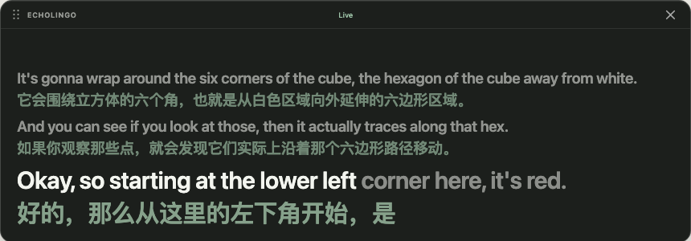
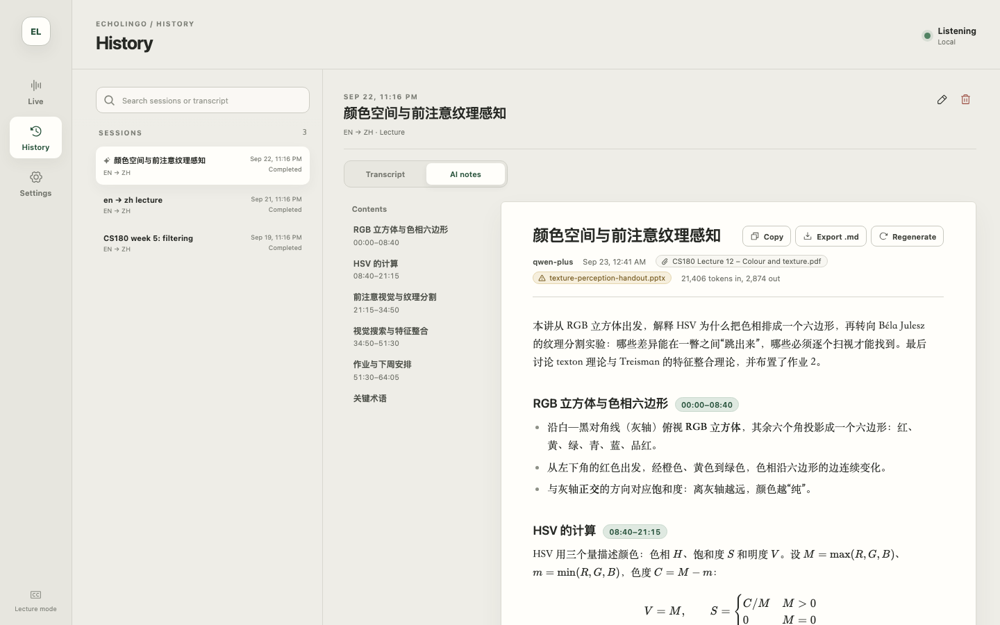
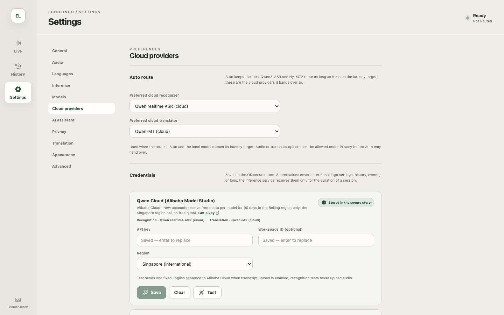
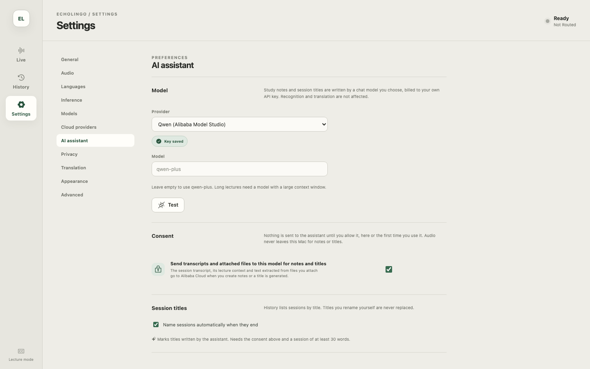
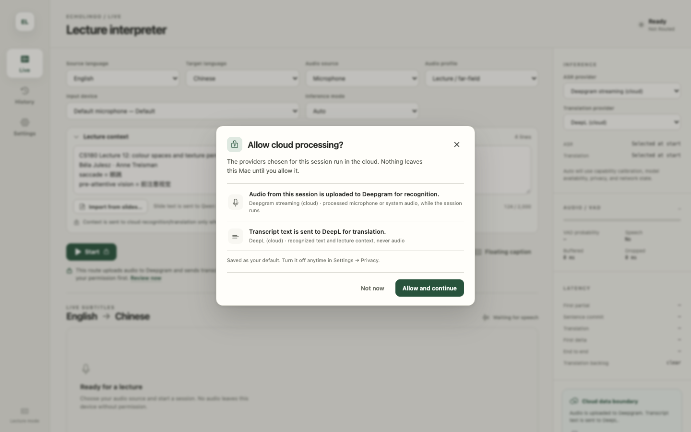

# EchoLingo

简体中文 | [English](README.en.md)

EchoLingo 是一款面向课堂的 Mac 实时同声字幕工具：把老师的讲课声音实时转成原文与译文逐句对照的双语字幕，下课后还可以用你自己选择的 AI 模型把转录整理成学习笔记。默认所有识别和翻译都在你的 Mac 上完成。

[](#系统要求)
[](https://github.com/Asphr726/EchoLingo/releases)
[](LICENSE)



> **v0.1.0 Beta**：目前只支持 Apple Silicon Mac（macOS 14 及以上），Windows 版正在计划中。应用界面暂时只有英文，下文中的按钮和菜单名称都按界面上的英文原样写出。

[特色](#特色) · [系统要求](#系统要求) · [安装](#安装) · [快速上手](#快速上手) · [使用指南](#使用指南) · [隐私](#隐私) · [常见问题](#常见问题) · [路线图](#路线图) · [从源码构建](#从源码构建) · [许可与致谢](#许可与致谢)

## 特色

- **本地优先，保护隐私**。语音识别（Qwen3-ASR）和翻译（Hy-MT2）默认都在本机运行，不需要账号，模型下载完成后可以离线使用。只有你主动启用某个云服务时，音频或文字才会离开这台 Mac，而且每一种上传都要先经过你明确同意。API 密钥保存在 macOS 钥匙串里。
- **为课堂远距离收音设计**。默认的 Lecture / far-field 音频配置会先在本机做降噪和自动增益（AGC）。语音检测只用来做标记，不会丢掉任何声音。一句话要等停顿确认结束后才会定稿，尽量避免把一句话从中间切断。
- **双语对照字幕和悬浮字幕窗**。主窗口里左边是原文、右边是译文，逐句对应。悬浮字幕窗可以一直浮在幻灯片、PDF 或笔记软件上面，字号、透明度和显示内容都能调整。
- **课程上下文**。上课前填好本节课的主题、人名和术语（可以写成 `术语 = 译法`），也可以从课件一键导入。识别和翻译都会参考这些信息，专有名词和术语更准确。长期使用的术语放进全局术语表即可。
- **AI 笔记**。AI 笔记会把口语化、零散的课堂转录整理成结构清晰的学习笔记，用你设置的翻译语言书写，公式用 LaTeX 显示。整理时还可以附上课程资料（PDF、PPTX、DOCX、Markdown、LaTeX、纯文本）。笔记和这节课一起保存，每一小节都标有时间段，点一下就能跳回对应的原文。笔记由你自己选择的聊天模型来写：可以是使用你自己密钥的云服务，也可以是本机运行的 Ollama 等。
- **自动命名**。设置好 AI 助手后，下课点 **Stop** 时它会自动为这节课起一个标题。你自己改过的标题不会被覆盖。
- **可插拔的云服务**。需要时可以改用云端识别或翻译，两者可以分开选择，例如本地识别配合云端翻译。
  - 识别：Qwen Cloud（阿里云百炼）、OpenAI Realtime、Deepgram、AssemblyAI（仅英语）、Gladia。
  - 翻译：Qwen-MT、兼容 OpenAI 接口的聊天模型（OpenAI、DeepSeek、Google Gemini、Groq、OpenRouter、硅基流动，以及 Ollama、LM Studio、vLLM 等自定义端点）、DeepL、Google Cloud Translation、Azure AI Translator。
  - 阿里云百炼的北京地域为新账号提供免费额度（每个模型 90 天）。
- **可搜索的历史记录**。按标题或转录内容搜索，可以重命名、删除，也可以导出为 Markdown、TXT、JSON、SRT、VTT 字幕，或者单独导出 AI 笔记。
- **支持语言**：英语、中文、日语、韩语，其中任意两种之间可以互译。

## 系统要求

| 项目 | 要求 |
| --- | --- |
| 系统 | macOS 14 Sonoma 或更新版本 |
| 芯片 | Apple Silicon（M1 或更新），不支持 Intel Mac |
| 内存 | 建议 16 GB 或以上 |
| 磁盘 | 本地模型共约 4.5 GB，建议预留 6 GB 以上的可用空间 |
| 权限 | 麦克风；如果要采集电脑播放的声音（网课、视频），还需要“屏幕与系统录音”权限 |
| 网络 | 只有下载模型、使用云服务或 AI 笔记时才需要 |

## 安装

1. 从 [GitHub Releases](https://github.com/Asphr726/EchoLingo/releases) 下载 `EchoLingo_0.1.0_aarch64.dmg`。
2. 打开 dmg，把 **EchoLingo** 拖进“应用程序”文件夹。
3. 第一次打开。Beta 版还没有经过 Apple 公证，macOS 会拦截它：
   - **macOS 14**：在“应用程序”里按住 Control 点按（或右键点按）EchoLingo，选择“打开”，再在弹出的对话框里点“打开”。
   - **macOS 15 及以上**：先双击打开一次，看到提示后点“完成”。然后打开“系统设置 → 隐私与安全性”，拉到页面底部，点 EchoLingo 旁边的“仍要打开”，输入密码确认。
   - 如果仍然提示“已损坏”或无法打开，可以在“终端”里运行下面这条命令，然后重新打开：

     ```bash
     xattr -dr com.apple.quarantine /Applications/EchoLingo.app
     ```

4. 下载本地模型。完成首次设置向导后，打开 **Settings → Models**，在 **Local model manager** 里点每个模型右侧的 **Download**：

   | 模型 | 用途 | 大小 |
   | --- | --- | --- |
   | Qwen3-ASR 0.6B | 语音识别 | 1.7 GB |
   | Hy-MT2 1.8B（Q4_K_M 量化） | 翻译 | 1.1 GB |
   | Qwen3 ForcedAligner 0.6B | 下课后把时间戳校准到逐字精度（可选，推荐） | 1.7 GB |

   每一行都会显示下载进度，下载完成后会自动校验文件完整性。已下载的模型可以随时点 **Verify** 重新校验，或者点 **Delete** 删除。如果下载失败或被中断，再点一次 **Download** 即可；如果已下载的模型文件不完整，这一行会显示 **Retry**，点它重新下载。模型从 Hugging Face 下载，只需要下载一次。

   > **中国大陆用户**：如果下载很慢或者一直失败，可以试试 Hugging Face 镜像。在“终端”里运行
   > `launchctl setenv HF_ENDPOINT https://hf-mirror.com`，然后用 ⌘Q 完全退出 EchoLingo，重新打开后再点 **Download**。
   > 这个设置在注销或重启 Mac 后失效。想换回官方源，运行 `launchctl unsetenv HF_ENDPOINT` 后重新打开应用。

## 快速上手

1. **首次设置向导**。第一次打开时，向导会带你完成 7 步：欢迎、选择语言、选择音频来源和音频配置、选择推理模式、授予权限、测试音频、完成。每一项之后都可以在设置里修改。
2. **下载模型**。按照上面[安装](#安装)第 4 步，在 **Settings → Models** 下载模型。
3. **开始上课**。回到 **Live** 页面，确认源语言（老师讲的语言）和目标语言（你想看的语言），点 **Start**。第一次加载模型需要 1 到 2 分钟。之后 EchoLingo 每次启动都会在后台预加载模型，点 Start 就能立即开始。
4. **打开悬浮字幕**。点 **Floating caption**，把小字幕窗拖到幻灯片旁边。
5. **下课**。点 **Stop**，这节课会自动保存到 **History**。如果设置了 AI 助手并开启了自动命名，它会马上得到一个标题。



## 使用指南

### Live：实时字幕



- **Source language / Target language**：源语言和目标语言，可以在英、中、日、韩之间任选两种。
- **Audio source**：选 **Microphone**（麦克风，适合教室现场）或 **System audio**（电脑正在播放的声音，适合网课、录播视频、线上会议）。选择 System audio 后，每次开始时 macOS 都会让你选择要采集的屏幕或 App。
- **Audio profile**：音频配置。课堂请保持 **Lecture / far-field**（默认，针对远距离收音）；面对面近距离交谈可以选 **Conversation**；**Raw diagnostics** 不做任何音频处理，只用于排查问题。
- **Input device**：选择使用哪个麦克风。
- **Inference mode**：推理模式。
  - **Local**：只用本机模型。
  - **Cloud**：使用云服务。
  - **Auto**：默认使用本机模型。点 Start 时，如果本机模型在这台 Mac 上跟不上实时速度，并且你已经允许了相应的上传，才会改用 **Settings → Cloud providers** 里设置的首选云服务。Auto 自己从来不会替你打开上传许可。
- 右侧的 **Inference** 面板可以分别指定识别服务（ASR provider）和翻译服务（Translation provider）。**Audio / VAD** 面板显示输入音量和是否检测到语音，**Latency** 面板显示各环节的延迟。最下面的卡片说明本节课的音频和文字会不会离开这台 Mac；在 Auto 模式或选了云服务时，这里还有 **Allow audio upload** 和 **Allow transcript upload** 两个开关。
- **Start / Pause / Resume / Stop**：开始、暂停、继续、结束。
- 字幕区左边是原文，右边是译文。最下面标着 **LIVE** 的一行是正在识别、尚未定稿的句子，颜色较浅的部分还可能变化。一句话定稿后会固定下来，译文随后补上。往上翻看时会暂停自动滚动，点 **Back to live** 回到最新位置。

**悬浮字幕**：点 **Floating caption**（或在 **Settings → General** 点 **Open caption**）会打开一个始终置顶的小窗口，可以拖动和调整大小，显示最近 1 到 3 句以及正在说的那一句。在 **Settings → Appearance** 里可以选择显示原文和译文、只显示原文或只显示译文，还能调整字号（18 到 72 px）、透明度和显示的句数。



**课程上下文（Lecture context）**：上课前展开这个面板，每行写一条：课程主题、人名、术语。写成 `pre-attentive vision = 前注意视觉` 这样的格式时，会作为本节课的术语对照。上限 2,000 个字符。

- 点 **Import from slides…** 可以从课件（PDF、PPTX、DOCX 等）中提取术语。没有设置 AI 助手时，文字只在本机提取。设置了 AI 助手但还没允许发送时，EchoLingo 会先询问能否把课件文字发给它来挑选术语和译法，选择 **Extract on this Mac** 就只在本机提取；已经允许发送时，课件文字会直接发给 AI 助手，按钮旁边的提示会写明这一点。
- 课程进行中，上下文变为只读。
- 每节课都要用的术语请放到 **Settings → Translation → Glossary**（全局术语表），每行一条，`#` 开头的行是注释，上限 4,000 个字符，从下一节课开始生效。
- 使用本机模型时，上下文只在本机使用。使用云服务时，只有打开了对应的上传开关，上下文才会随音频或文字一起发给该服务。

### History：历史记录和 AI 笔记



- **搜索和整理**：左侧搜索框可以搜索课程标题和转录内容。标题前带小星标（✦）的是 AI 起的标题。右上角的铅笔按钮用来重命名，垃圾桶按钮用来删除（会二次确认，并同时删除这节课的 AI 笔记）。仍是默认标题（例如 `en → zh lecture`）的课程会多一个星标按钮（**Generate title**），可以手动生成标题。
- **Transcript 标签**：逐句双语对照，带时间戳。**Export** 一栏可以导出 MD、TXT、JSON、SRT、VTT；如果这节课已经有 AI 笔记，导出的 Markdown 会把笔记放在最前面。下课后，本机的对齐模型会在后台把时间戳校准到逐字精度，此时 **Timing** 显示为 `word-aligned`。
- **AI notes 标签**：
  1. 先在 **Settings → AI assistant** 设置好 AI 助手（见下文）。
  2. 点 **Create notes**。EchoLingo 会询问要不要附上课程资料（**Add files…**），也可以直接点 **Create without files**。最多 5 个文件，每个不超过 25 MB，支持 PDF、PowerPoint（.pptx）、Word（.docx）、Markdown、LaTeX、CSV 和纯文本。文字在本机提取，只发送提取出的文字；没有文字层的扫描版 PDF 会被提示并跳过。
  3. 笔记一边生成一边显示，用这节课的翻译语言书写，包含标题、概述、分节内容、公式和关键术语。超过约 20 分钟的课程会按每段 12 到 15 分钟分批整理，最后合成一份完整的笔记。
  4. 每个小节标题旁边的时间段（如 `08:40–21:15`）可以点击，点击后跳到转录里对应的位置，再点 **Back to notes** 返回。左侧的 **Contents** 目录可以快速定位小节。
  5. 工具栏上有 **Copy**（复制 Markdown）、**Export .md** 和 **Regenerate**（新笔记生成完成后才会替换旧笔记）。笔记和课程一起保存，下次打开时直接显示，不会再次调用模型。

### Settings：设置

| 分区 | 内容 |
| --- | --- |
| General | 打开悬浮字幕 |
| Audio | 默认音频配置 |
| Languages | 默认源语言和目标语言 |
| Inference | 默认推理模式（Auto / Local / Cloud）；启动时是否预加载本地模型 |
| Models | 默认识别和翻译服务；下载、校验、删除本地模型 |
| Cloud providers | Auto 模式下的首选云端识别和翻译服务；每个服务商的密钥卡片 |
| AI assistant | AI 笔记和标题使用的模型、发送同意、自动命名 |
| Privacy | 两个上传开关：音频上传（Audio upload）和文字上传（Transcript upload） |
| Translation | 全局术语表 |
| Appearance | 悬浮字幕的外观 |
| Advanced | 诊断信息和日志目录 |

**Cloud providers（云服务）**：每个服务商一张卡片。粘贴密钥后点 **Save**，密钥会存进 macOS 钥匙串；点 **Clear** 可以删除它；点 **Test** 检查配置是否正确。

- 识别服务的测试只完成一次身份验证握手，不上传任何音频。
- 翻译服务的测试只发送一句固定的英文 “Welcome to the lecture.”，而且需要允许文字上传。还没允许时，只做翻译的服务商会在测试前先征求你的同意；同时提供识别和翻译的服务商（例如 Qwen Cloud、OpenAI）会先只测识别，点结果下方的 **Include translation in the test…** 可以把翻译也加进测试。
- Qwen Cloud 卡片上的 **Region** 可以选 **Singapore (international)** 或 **Beijing (mainland China)**，必须和你创建密钥的控制台一致。北京地域有免费额度。**Workspace ID** 是可选的，留空即可。
- 每个服务商的注册方法、免费额度和常见错误见 [云服务设置说明](docs/cloud-setup.md)（英文）。



**AI assistant（AI 助手）**：AI 笔记和自动标题由你选择的聊天模型来写，费用计入你自己的 API 账号，识别和翻译不受影响。

- **Provider**：Qwen（阿里云百炼）、OpenAI、DeepSeek、Google Gemini、Groq、OpenRouter、硅基流动，或自定义的 OpenAI 兼容端点（例如本机运行的 Ollama）。先在 **Cloud providers** 里保存对应的密钥；自定义端点则要在那里填写 **Base URL**，密钥可以不填。
- **Model**：留空时使用默认模型（例如 `qwen-plus`、`gpt-4o-mini`）。长课程请选择上下文窗口更大的模型。
- **Test**：只发送一句固定的提示，不发送任何转录内容。
- **Consent**：打开 “Send transcripts and attached files to this model for notes and titles” 后，才允许把转录和附件文字发给这个模型。同意只针对当前选择的服务商，换一个 Provider 后需要重新同意。
- **Session titles**：打开 “Name sessions automatically when they end”（默认打开）并且已经同意发送后，至少 30 个词的课程会在下课时自动得到一个用目标语言写的标题。



**同意对话框**：带小锁图标的按钮（例如选了云服务时的 **Start**，以及 **Create notes**、**Generate title**、翻译服务的 **Test**）表示这一步需要你的同意。点击后会弹出对话框，说明哪些内容会发给谁、哪些内容留在本机。对话框打开时焦点在不上传的按钮上（**Not now**，导入课件时是 **Extract on this Mac**），只有你点了 **Allow…** 开头的按钮才会生效。同意会保存为默认设置，之后可以随时在 **Settings → Privacy** 或 **Settings → AI assistant** 里关闭。如果还缺少设置（比如没有保存密钥），对话框里会有按钮直接打开对应的设置页面。



## 隐私

**始终留在本机的内容**

- 音频的采集、降噪、增益、语音检测和重采样。
- 使用本机模型时的全部识别和翻译。
- 课程历史：转录、译文、AI 笔记和设置。
- 下课后用来校准时间戳的临时音频：校准成功、取消或失败后立即删除；应用异常退出时留下的文件，超过 24 小时后会在下次开始课程时清理。历史记录里不保存完整录音。

**会发送出去的内容（仅在你同意之后）**

| 功能 | 发送的内容 | 发送给 | 需要打开的开关 |
| --- | --- | --- | --- |
| 云端识别 | 本机处理后的课程音频，在课程进行期间持续上传；多数服务还会收到课程上下文或其中的术语，作为识别提示 | 你选择的识别服务 | Settings → Privacy → Audio upload |
| 云端翻译 | 识别出的原文句子；视服务而定，还可能包括少量前文（Qwen-MT 还包括之前的译文）、课程主题和术语对照 | 你选择的翻译服务 | Settings → Privacy → Transcript upload |
| AI 笔记和标题 | 这节课的转录、课程上下文、附件中提取的文字 | 你在 AI assistant 中选择的服务 | Settings → AI assistant → Consent |
| 从课件导入（AI 挑选术语） | 从课件中提取的文字 | 同上 | 同上 |
| 连接测试 | 识别：只做握手；翻译：一句固定英文；AI 助手：一句固定提示 | 被测试的服务 | 翻译测试需要 Transcript upload，其余无 |

AI 笔记和标题永远不会发送音频。

**如何撤销**：在 **Settings → Privacy** 关闭音频上传或文字上传；在 **Settings → AI assistant** 关闭 Consent，或把 Provider 设为 **Off**；在 **Settings → Cloud providers** 点 **Clear** 从钥匙串里删除密钥。已经发送给第三方服务的数据，受该服务自己的隐私政策约束。

**数据存放位置**：`~/Library/Application Support/app.echolingo.desktop/`

| 路径 | 内容 |
| --- | --- |
| `history.sqlite` | 课程、转录、译文、AI 笔记 |
| `preferences.json` | 设置（不含密钥） |
| `models/` | 本地模型 |
| `alignment-spool/` | 时间戳校准用的临时音频 |
| `logs/` | 日志，用于排查问题 |

密钥保存在 macOS 钥匙串中（服务名 `app.echolingo.desktop`），不会写进设置文件或日志。完全卸载时，先在 **Cloud providers** 中逐个点 **Clear** 删除密钥，再删除应用和上面这个文件夹。

## 常见问题

### 模型下载很慢或失败

在中国大陆可以试试 Hugging Face 镜像：运行 `launchctl setenv HF_ENDPOINT https://hf-mirror.com`，⌘Q 退出后重新打开 EchoLingo，再点 **Download**。下载会使用 macOS 的系统代理设置；如果你的代理软件没有设置系统代理，也可以用同样的方式指定：`launchctl setenv HTTPS_PROXY http://127.0.0.1:7890`（换成你自己的代理地址）。下载失败或中断后，再点一次 **Download** 即可。

### 点 Start 后提示模型未就绪（required local model is not ready）

说明本地模型还没有下载，请到 **Settings → Models** 下载。

### 第一次点 Start 要等很久

第一次加载模型需要 1 到 2 分钟。在 **Settings → Inference** 打开 “Preload local models when EchoLingo launches”（默认已打开）后，应用启动时会在后台加载好模型。

### 没有字幕，或者听不到声音

- 打开“系统设置 → 隐私与安全性 → 麦克风”，确认 EchoLingo 已开启。
- 采集电脑播放的声音时，还要在“系统设置 → 隐私与安全性 → 屏幕与系统录音”（macOS 14 上叫“屏幕录制”）中开启 EchoLingo，然后重新打开应用。
- 更新 Beta 版后，macOS 可能会要求重新授权。如果开关已经打开但仍然没有声音，可以先把 EchoLingo 从列表中移除，再重新授权。
- 看一下 **Live** 右侧 **Audio / VAD** 面板的音量条有没有跳动。

### Qwen Cloud 测试失败

- HTTP 401：通常是 **Region** 和密钥不匹配。在[百炼控制台](https://bailian.console.aliyun.com)（北京）创建的密钥要选 **Beijing**，在[国际站 Model Studio 控制台](https://modelstudio.console.alibabacloud.com)创建的要选 **Singapore**。
- 与工作空间相关的 HTTP 403：清空 **Workspace ID**，使用密钥的默认工作空间。
- HTTP 403 `AllocationQuota.FreeTierOnly`：免费额度已经用完。
- 在中国大陆，百炼北京地域、DeepSeek 和硅基流动可以直接访问；OpenAI、Deepgram、AssemblyAI、Gladia、DeepL、Google 和 Azure 通常需要代理。

### AI 笔记报错

| 提示（英文界面） | 含义 | 解决方法 |
| --- | --- | --- |
| The AI assistant is not set up yet. | 还没有选择 AI 助手或保存密钥 | 在 **Settings → AI assistant** 选择 Provider，并在 **Cloud providers** 保存密钥 |
| Sending transcripts to the AI assistant is turned off. | 没有允许发送转录 | 在 **Settings → AI assistant** 打开 Consent |
| The provider rejected the API key. | 密钥被拒绝 | 在 **Cloud providers** 检查密钥（Qwen 还要检查 Region） |
| The provider’s rate limit or quota was reached. | 触发了服务商的速率限制或额度上限 | 等一会儿再试，或者换一个服务商 |
| This session is too long for the selected model. | 课程太长，超出了模型的上下文窗口 | 换一个上下文更大的模型，或者少附几个文件 |
| EchoLingo could not reach the provider. | 连不上服务商 | 检查网络和代理 |

出错时旧的笔记不会丢失。错误提示里通常有按钮，可以直接打开对应的设置页面，或者点 **Try again** 重试。

### 识别不准怎么办

- 上课前填写**课程上下文**：主题、人名、专业术语，写得越具体越好。也可以用 **Import from slides…** 从课件中导入。
- 把长期用到的术语和固定译法写进 **Settings → Translation → Glossary**。
- 麦克风尽量朝向讲台或教室扬声器，远离空调出风口和电脑风扇；条件允许的话用外接麦克风。音频配置保持 **Lecture / far-field**。
- 确认源语言选对了。网课和视频请用 **System audio**，不要让麦克风去收扬声器外放的声音。

### 能完全离线使用吗？

可以。模型下载完成后，本机识别和翻译都不需要网络。AI 笔记需要联网，除非你把 AI 助手设成本机运行的自定义端点（例如 Ollama）。

## 路线图

- **Windows 版（计划中）**：原生 WASAPI 音频采集（包括系统声音回环录制）、在 CPU / CUDA / DirectML 上运行本地推理、适配 Windows 的 llama.cpp、打包内置的推理服务、代码签名。
- Linux 版。
- Apple 公证，免去首次打开时的手动步骤。
- 支持更多语言。

## 从源码构建

需要 macOS 14 及以上的 Apple Silicon Mac、Xcode Command Line Tools、Node.js 22 LTS、Rust 1.88 及以上（stable），以及 Conda（Miniconda 或 Miniforge）。

```bash
git clone https://github.com/Asphr726/EchoLingo.git
cd EchoLingo

# Python 环境和语音识别运行时
conda env create -f environment.yml
conda activate echolingo-spike1
python -m pip install -e '.[qwen]'

# 语音检测模型和翻译运行时（llama.cpp）
mkdir -p models
curl -L -o models/silero_vad.onnx https://github.com/snakers4/silero-vad/raw/master/src/silero_vad/data/silero_vad.onnx
python scripts/fetch_llama_runtime.py

# 桌面应用
npm install
python scripts/build_sidecar.py --clean      # 打包内置推理服务
npm run desktop:dev                          # 开发模式运行
APPLE_SIGNING_IDENTITY=- npm run desktop:build   # 本机自签名构建
```

构建产物位于 `target/release/bundle/dmg/EchoLingo_0.1.0_aarch64.dmg`。`APPLE_SIGNING_IDENTITY=-` 生成的是只适合自己使用的临时签名；公开分发需要 Developer ID 证书和 Apple 公证。

运行测试：

```bash
pytest                    # Python（需要先激活 conda 环境）
cargo test --workspace    # Rust
npm run typecheck && npm run test:desktop   # 界面
```

## 许可与致谢

EchoLingo 以 [Apache License 2.0](LICENSE) 开源。本地模型不随应用分发，由你在应用内从 Hugging Face 下载，遵循各自的许可证。完整的第三方组件和许可证列表见 [docs/third-party-components.md](docs/third-party-components.md)。

感谢这些项目：

- [Qwen3-ASR](https://github.com/QwenLM/Qwen3-ASR)（通义千问团队），语音识别和强制对齐模型
- [Hy-MT2](https://huggingface.co/tencent/Hy-MT2-1.8B-GGUF)（腾讯混元），本地翻译模型
- [WhisperLiveKit](https://github.com/QuentinFuxa/WhisperLiveKit)，流式识别框架
- [llama.cpp](https://github.com/ggml-org/llama.cpp)，本地翻译模型的推理运行时
- [Silero VAD](https://github.com/snakers4/silero-vad)，语音检测
- [Tauri](https://tauri.app)，桌面应用框架
